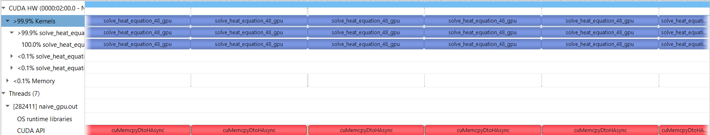
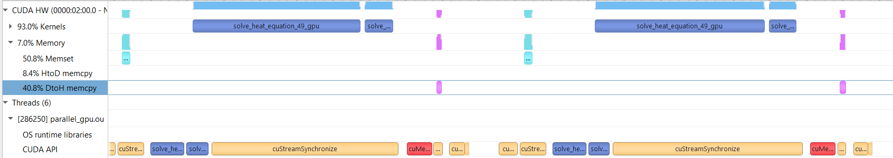
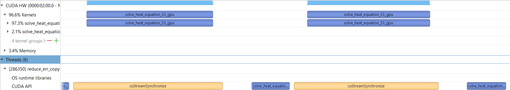
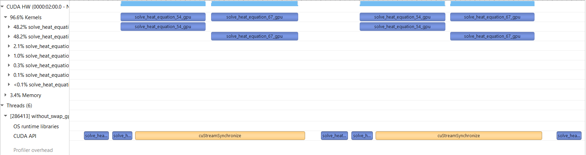
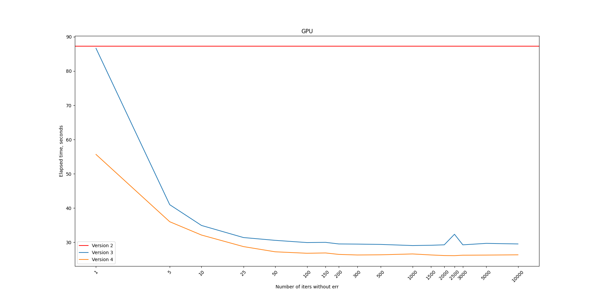
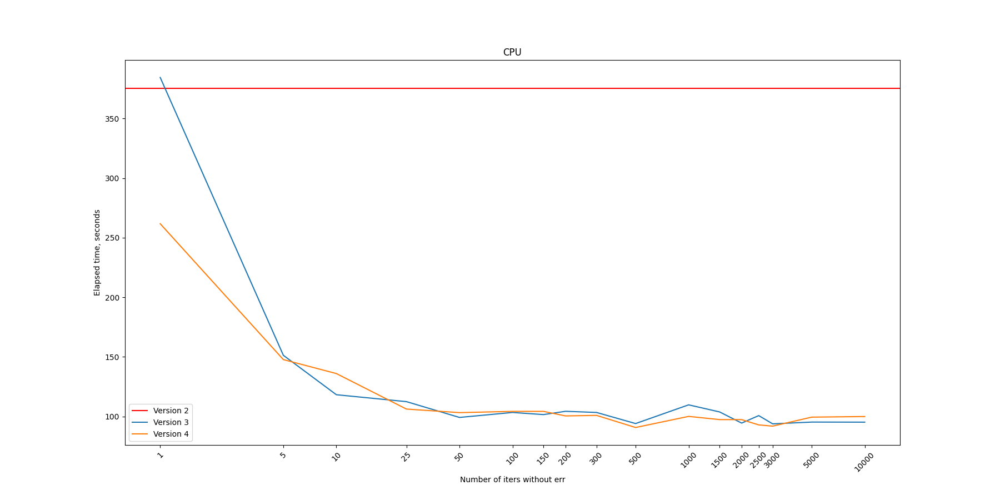

# openacc_heat_equation

## Задание
В данной работе нужно было реализовать уравнение теплопроводности в двумерной области на  равномерных сетках с начальной инициализацией в сетки в граничных точках.

После успешной реализации на CPU нужно было перенести программу на GPU используя директивы OpenACC, провести оптимизацию кода

## Ход работы

### <ins>Версия 1</ins>
Сначала была написана наивная версия [программы](src/heat_equation_solver_naive.c), где директивы OpenACC были расставлены без учета особенностей цикла подсчета следующей сетки **next_grid** на основе текущей **curr_grid**. По выводу компилятора стало понятно, что он думает, что итерации в цикле имеют зависимость по данным:
```
solve_heat_equation:
     22, Generating create(buff_grid[:grid_sqr+grid_sqr]) [if not already present]
         Generating copy(init_grid[:grid_sqr]) [if not already present]
     29, Generating present(curr_grid[:grid_sqr],next_grid[:grid_sqr],init_grid[:grid_sqr])
     31, Loop carried dependence due to exposed use of next_grid,curr_grid prevents parallelization
         Complex loop carried dependence of next_grid->,curr_grid-> prevents parallelization
         Accelerator serial kernel generated
         Generating Tesla code
         31, #pragma acc loop seq collapse(2)
         33,   collapsed */
     33, Loop carried dependence due to exposed use of next_grid,curr_grid prevents parallelization
         Complex loop carried dependence of next_grid->,curr_grid-> prevents parallelization
     48, Generating present(next_grid[:grid_sqr],curr_grid[:grid_sqr])
     52, Complex loop carried dependence of curr_grid->,next_grid-> prevents parallelization
         Loop carried dependence due to exposed use of next_grid[:grid_sqr] prevents parallelization
         Loop carried scalar dependence for err at line 61
         Scalar last value needed after loop for err at line 42
         Accelerator serial kernel generated
         Generating Tesla code
         52, #pragma acc loop seq collapse(2)
         54,   collapsed */
     54, Complex loop carried dependence of curr_grid->,next_grid-> prevents parallelization
         Loop carried dependence due to exposed use of next_grid[:i1+grid_sqr] prevents parallelization
         Loop carried scalar dependence for err at line 61
         Scalar last value needed after loop for err at line 42
     74, Generating present(init_grid[:grid_sqr],curr_grid[:grid_sqr])
     76, Loop carried dependence due to exposed use of init_grid prevents parallelization
         Accelerator serial kernel generated
         Generating Tesla code
         76, #pragma acc loop seq collapse(2)
         78,   collapsed */
     78, Loop carried dependence due to exposed use of init_grid prevents parallelization
```
Поэтому он не смог распараллелить цикл. То же самое с переменной ошибки **err**: из-за операции типа ***<ins>reduce</ins>***, он также не мог распараллелить цикл из-за зависимости по данным.


<p align="center">Профиль "Версии 1". Видно, что на каждую <ins>итерацию</ins>(!!!) запускается ядро, и после каждой итерации ошибка <b>err</b> копируется с девайса на хост</p>

### <ins>Версия 2</ins>

Для решения этой проблемы был написан второй вариант [программы](src/heat_equation_solver_parallel.c), где в директивах распараллеливания цикла обновления сетки были добавлены `independent reduction(max: err)`. Из-за компилятор смог распараллелить цикл обновления сетки, что дало очень сильное ускорение программе.

```
18, Generating copy(init_grid[:grid_sqr]) [if not already present]
         Generating create(buff_grid[:grid_sqr+grid_sqr]) [if not already present]
     25, Generating present(curr_grid[:grid_sqr],next_grid[:grid_sqr],init_grid[:grid_sqr])
         Generating Tesla code
         27, #pragma acc loop gang, vector(128) collapse(2) /* blockIdx.x threadIdx.x */
         29,   /* blockIdx.x threadIdx.x collapsed */
     44, Generating present(next_grid[:grid_sqr],curr_grid[:grid_sqr])
         Generating implicit copy(err) [if not already present]
     47, Loop is parallelizable
     49, Loop is parallelizable
         Generating Tesla code
         47, #pragma acc loop gang, vector(128) collapse(2) /* blockIdx.x threadIdx.x */
             Generating reduction(max:err)
         49,   /* blockIdx.x threadIdx.x collapsed */
     68, Generating present(curr_grid[:grid_sqr],init_grid[:grid_sqr])
         Generating Tesla code
         70, #pragma acc loop gang, vector(128) collapse(2) /* blockIdx.x threadIdx.x */
         72,   /* blockIdx.x threadIdx.x collapsed */
```

### <ins>Версия 3</ins>

Дальнейшее профилирование показало, что немаленькую часть времени занимает передача переменной ошибки **err** между памятью CPU и GPU, а также синхронизация для этого



<p align="center">Профиль программы "Версия 2"</p>

На рисунке изображено следующее: сначала идет исполнение цикла (`solve_heat_equation_49_gpu` и маленькая часть ядра для накопления ошибки **err** `solve_...`), далее идет копия **err** на хост, и потом идет новая итерация: инициализация на **err** девайсе (голубой отрезок, в нем `Memset`) и опять исполнение цикла. 

Для решения этой проблемы использовался следующий [подход](src/heat_equation_solver_reduce_err_copy.c): вычислять ошибку не каждую итерацию, а каждые N итераций. Этот подход должен сократить время путем сокращения вызова копирования данных с хоста на девайс и обратно, а также сократить количество вычислений ошибки **err**.


<p align="center">Профиль программы "Версия 3". Видно, что для итерации, где не происходит вычисления ошибки, убрался промежуток с копированием ошибки <b>err</b> на девайс и обратно, а также убралось вычисления <b>err</b> в отдельном ядре</p>

### <ins>Версия 4</ins>

Если посмотреть на профиль Версии 3, то можно заметить, что приличное время занимает старт ядра вычисления новой сетки. 

В программе у нас два буффера для вычисления сетки: текущий **curr_grid** и следующий **next_grid**. И после каждой итерации происходит `swap` указателей на буфферы **next_grid** и **curr_grid**, что позволяет не использовать копирование значений сеток. А что, если попробовать в одном `#pragma acc kernels`  делать сразу же 2 вычисления: **next_grid** по **curr_grid** и **curr_grid** по **next_grid**, тем самым пока запускается ядро для 1-ого вычисления, у нас может запуститься ядро для 2-ого вычисления и ждать его.


<p align="center">Профиль программы "Версия 4"</p>

Действительно, как видно из профиля, ядро для вычисления 2-ого вычисления стартует практически параллельно со стартом 1-ого вычислений и, видимо, ожидает его завершения, чтобы не нарушать зависимость по данным.

## Бенчмарки

Был написан [скрипт](./run_benchmarks.sh) для замера времени работы в зависимости от данных. 

Ниже приведены замеры времени работы различных версий программы на GPU и CPU по [таблице бенчмарков](benchmarks.csv). Бенчмарки замерялись для сетки размера 512x512 с **etol=1e-6** и максимальным количеством итераций, равным 1'000'000. По причине очень медленной работы для данных такого же размера не была замерена версия 1, но она была замерена для количества итераций 100. 


<p align="center">Замеры для GPU</p>


<p align="center">Замеры для CPU</p>

Глядя на изображения, можно сделать следующие выводы:
1. Программы на GPU для более-менее больших данных работают быстрее, чем на CPU
2. Каждая оптимизация приводила к ускорению программы как на GPU, так и для CPU
3. Количество итераций без подсчета ошибки **err** перестает влиять на время работы программы примерно после 1500, так что 1500 - оптимальный вариант для таких данных.
